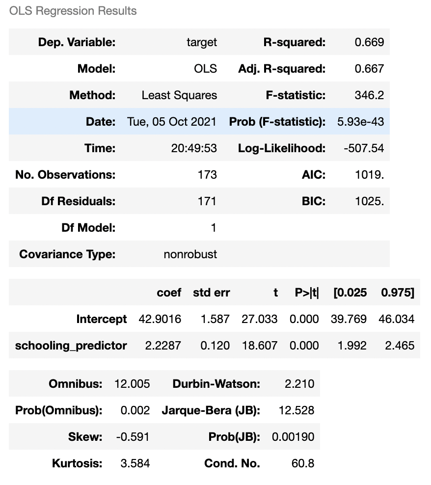
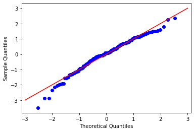

# (Simple) Linear Regression: A Practical Guide

Authors: Richard Aw, Lakshmi Manne, Shambhavi Gupta, Arman Hashemizadeh

> In fulfillment of the requirements for the Final Project of [Communications for Analytics (MSDS 610)](https://catalog.usfca.edu/preview_course_nopop.php?catoid=35&coid=533754). MSDS 610 is a core class under the MS in Data Science program at the University of San Francisco. 


## About This Guide

The goal of this guide is to provide a concise and “hands-on” introduction to linear regression, with a topical focus on **simple linear regression (SLR)** and a pedagogical emphasis on *building intuition* rather than regurgitating facts. It is meant to be accessible to those with *just enough* (bittersweet) memories of introductory probability and statistics. Basic familiarity with Python programming would be helpful as well, though not strictly necessary. To this end, we have structured the guide as follows: 

1. **Linear Regression in a Nutshell** — “No-frills” overview of the essentials and motivation for linear regression.

2. **Linear Regression in Practice** — Gentle tutorial on implementing SLR in Python, using [the WHO Life Expectancy Dataset](https://www.kaggle.com/kumarajarshi/life-expectancy-who?select=Life+Expectancy+Data.csv). 


## Linear Regression in a Nutshell

### What *is* linear regression?

Linear regression is the process of *estimating* the parameters in the equation for the straight line or plane that best fits some given data. Thus, to perform linear regression is to (i) find the numbers that specify the line/plane of best fit and (ii) determine how confident we can be in those numbers. 

> Remember from Physics 101 that whenever we are estimating the value of something like height, we don’t just state our guess but provide error bounds for it as well? This is because there is no guarantee that our guess *is* the true value. Linear regression is based on the same logic!

There are two types of linear regression: simple linear regression (SLR) and multiple linear regression (MLR). 

* **SLR** is performed when we regress the response variable (*Y*) against only *one* predictor variable (*X*) — this is why it is dubbed “simple”. Example: regressing “price of milk” against “milk’s shelf life”.

* **MLR** is performed when there are *multiple* predictor variables (two or more *X*’s). Example: regressing “price of milk” against “milk’s shelf life”, “milk’s tastiness score”, and “milk’s nutrition score”.

An intuitive way to grasp the difference between SLR and MLR is to visualize them both, side by side:


*Note that the 3D plot on the right depicts MLR in the case of two predictor variables; MLR also includes cases where there are even more predictor variables (X's)!* (<a href="https://www.keboola.com/blog/linear-regression-machine-learning">Image Source</a>)

In this way, we can see that SLR is about fitting the best *line* through a plot of 2D data, while MLR is about fitting the best *plane* through a plot of 3D or higher-dimensional data. (More about what 'best' means, exactly, in the tutorial section.)


### Why *care* about linear regression?

Linear regression enables us to carry out inference and prediction.

> This makes linear regression **practically useful**: Inference and prediction are both critical to the commercial success of many companies, and increasingly so given that [the world economy is becoming more ‘data-driven’](https://www2.deloitte.com/mt/en/pages/technology/articles/mt-what-is-digital-economy.html). If you want to [stay relevant](https://hbr.org/2020/02/boost-your-teams-data-literacy), or just [earn a *healthy* salary](https://datasciencedegree.wisconsin.edu/data-science/data-scientist-salary/), you *should* care about linear regression!

**Inference** is about understanding the relationship between variables in the given data. Regressing a chosen response variable against one or more predictor variables would enable us to evaluate not only the significance of *each* of the predictor variables on the response variable (e.g., does “milk’s shelf life” have a significant influence on “price of milk”?), but also the *relative* importance of the predictor variables (e.g., which has a greater impact on “price of milk” — “milk’s shelf life” or “milk’s tastiness score”?).

**Prediction** is about computing *projected* values for the response variable based on new input values of the predictor variables. Since linear regression gives us an equation that relates the response variable (e.g., “price of milk”) to the predictor variables (e.g., “milk’s shelf life”, “milk’s tastiness score”, etc.), we can ‘feed’ new values for “milk’s shelf life” and “milk’s tastiness score” to the equation and obtain a projected value for “price of milk”. In this way, linear regression enables us to *predict* the future given new data!


## Linear Regression in Practice

### Getting started

- We will need to install some Python packages. You can do so by running the following line of code in the command-line:
  
  `pip install pandas, matplotlib, seaborn, statsmodels`
  
- Import these packages in your notebook or Python script after installation:
  
  ```python
  import pandas as pd
  import matplotlib.pyplot as plt
  import statsmodels.formula.api as smf
  import numpy as np
  import statsmodels.api as sm
  ```

-  We will be using the WHO Life Expectancy Dataset, which can be downloaded [here on Kaggle](https://www.kaggle.com/kumarajarshi/life-expectancy-who?select=Life+Expectancy+Data.csv). 

  - If you're planning to run the same block of code below in a Jupyter/CoLab notebook, be sure to *save the dataset in the same folder as your notebook*. Otherwise, you will have to modify the file path in `df = pd.read_csv('Life Expectancy Data.csv')`.


### Extracting two variables from the dataset for SLR

The dataset contains many features, so we have lots of options for choosing which features to include as the response variable and predictor variable in our SLR model. For pedagogical reasons, we want to find two variables that are sufficiently correlated. To do so, we can plot a correlation matrix:

```python
df = pd.read_csv('Life Expectancy Data.csv')
# Focusing on 2015
df_2015 = df[df['Year'] == 2015].drop(columns='Year')
df_2015_subset = df_2015[['Country', 'Status', 'Life expectancy ',
                          'Adult Mortality', 'infant deaths', 'Hepatitis B',
                          'Measles ', ' BMI ', 'Diphtheria ',
                          ' HIV/AIDS', 'GDP', 'Schooling']]
corr_matrix_2015 = df_2015_subset.corr()
plt.figure(figsize=(12, 5))
sns.heatmap(data=corr_matrix_2015, annot=True, cbar=False)
```


It appears that "Schooling" has a pretty strong correlation of 0.82 with "Life expectancy". As such, let us use "Life expectancy" and "Schooling" as our response variable and predictor variable, respectively.


### Creating a scatter plot of the two variables

We can easily visualize the relationship between "Schooling" and "Life expectancy" by producing a scatter plot as follows:

```python
schooling_predictor = df_2015['Schooling']
target = df_2015['Life expectancy ']
fig, ax = plt.subplots(figsize=(12,8))
ax.scatter(schooling_predictor, target)
ax.set_xlabel("Schooling (Avg. number of years)", fontsize='x-large')
ax.set_ylabel("Life Expectancy (years)", fontsize='x-large')
ax.set_title("WHO Country Life Expectancy Dataset, 2015", fontsize='x-large', y=1.05);
ax.spines['right'].set_visible(False)
ax.spines['top'].set_visible(False)
```


### Finding the line of best fit (i.e., parameter estimation)

From the scatter plot, it seems that we could definitely fit a straight line through those points. How, then, can we obtain the numbers that specify the slope and position of this line of *best fit*? There are various methods to do so. 

- **Ordinary least squares estimation (OLSE)** — wherein "best" means minimizing the sum of squared errors — is probably the most well-known method. Nonetheless, it should not be conflated with linear regression itself. Linear regression is a general process that may be initiated using a specific method; OLSE is simply *a* specific method!

  > The word "ordinary" is there to help distinguish between the vanilla version of least squares estimation (i.e., OLSE) and slight variants of OLSE that effectively still count as least squares estimation. 

- Some examples of other methods: (i) **Least absolute deviations estimation**, where "best" means minimizing the sum of absolute errors. (ii) **Maximum likelihood estimation (MLE)**, where “best” means maximizing the probability that each of the random error terms in our linear model is normally distributed.

  > MLE and OLSE actually yield the same parameter estimates in SLR!

Fortunately, there are several Python packages (e.g., `statsmodels`) that help automate the *entire* process of SLR, as we will come to appreciate in just a few seconds...


### Assessing the precision of our parameter estimates

Having determined that there is a linear relationship between "Schooling" and "Life expectancy", we can use the `statsmodels` package to fit an SLR model using OLSE, as follows: 

```python
model = smf.ols('target~schooling_predictor', data=df_2015).fit()
model.summary()
```



> This is *truly* amazing. With just two lines of code, we get the parameter estimates, their associated p-values, and many other test statistics — all neatly printed out in one summary table! 

From the summary table: the p-value for `schooling_predictor` is 0.000, which suggests that "Schooling" is a **significant predictor** of "Life expectancy". The coefficient for "Schooling" indicates that for every 1 year increment in average number of school years, the life expectancy increases by 2.3387 years. 

Moral of the story? **Education matters.** 


### Re-evaluating the SLR model

At the beginning, we really just looked at how the data points were arranged on the scatter plot and intuitively fitted a straight line (i.e., our SLR model) through those points. Is this justifiable? What assumptions did we make in presupposing the SLR model, and do they hold up for the data that we have used?

Let us check all of the assumptions, one by one.

#### 1. The mean of the residual error terms should be 0, ideally. 

The SLR model contains a random error term that is meant to account for *random* fluctuations in the data. These fluctuations are random in the sense that they should add up to 0 *on average* (i.e., over an infinitely long period of time, or with an infinitely large sample of data). Of course, *perfect* data does not exist, so it is *highly unlikely* that a real-world dataset would have residual error terms with mean 0.

Nonetheless, we can visually check whether their mean lies *close to* 0 via a **residual plot**:

```python
residuals = model.resid
predicted_values = model.predict()
fig, ax = plt.subplots(figsize=(12, 8))
ax.scatter(predicted_values, residuals)
ax.axhline(np.mean(residuals), color='red')
ax.set_xlabel('Predicted values')
ax.set_ylabel('Residuals')
ax.set_title('Residuals v/s Predicted values')
ax.spines['right'].set_visible(False)
ax.spines['top'].set_visible(False)
```


We see that for our data, the residuals are scattered evenly around the bold red line (the mean of the residual errors). Hence the above assumption can be considered met.

 
#### 2. The variance of the residual error terms should be *somewhat* constant. 
 
This assumption is particularly important because numerous hypothesis tests that evaluate the precision of our parameter estimates are based on it. Thus, if this assumption is not met, said hypothesis tests would not be reliable. 

We can check whether this assumption is satisfied by inspecting the residual plot again. The (vertical) spread of the data points is not inconsistent — there is no drastic change in the spread as we move along the x-axis. Hence the above assumption can be considered met.


#### 3. The random error terms in the SLR model are independent and identically distributed.

The criterion of independence ensures that the samples we draw are truly random and not correlated with each other. This, together with the criterion of being identically distributed, helps ensure that **when analyzing a given sample of data we are fundamentally assessing a *stable* phenomenon**. (Otherwise, how can we be confident of inferring the truth from a data sample, if the reality that generates said data sample is inconsistent?)

We can check whether this assumption is satisfied by inspecting the residual plot yet again. Since there is no *clear, systematic pattern* that the residual errors follow, we have no reason to believe that the assumption is violated. 


#### 4. The residual error terms should be close to being normally distributed. 

This assumption is important because the *t* test is built on it. If it were violated to a significant extent, we would not be able to make reliable evaluations about our parameter estimates with the *t* test.

We can check whether this assumption is satisfied by inspecting the **QQ plot** of the data. A QQ plot compares a given dataset's distribution to the distribution of a standard normal, thereby allowing us to judge the extent to which our data's distribution deviates from the standard normal distribution. A plot that is linear and set at a 45-degree angle tells us that our data distribution is normal.

```python
standardized_residuals = (model.resid - np.mean(model.resid)) / np.std(model.resid)
sm.qqplot(standardized_residuals)
plt.plot([-3, 3], [-3,3], color='red')
```



We can see that the QQ plot is almost linear with slight deviations at the ends, so this assumption can be considered met.


## In Conclusion...

To ensure we have not lost the forest for the trees, we should always remember this: When performing linear regression, we are not determining the true parameters. We are merely *estimating* them, and this is already assuming that our conception of the ground truth (i.e., the SLR model) is correct. The true relationship between variables might not be perfectly linear — we may never know! 

> “Essentially, all models are wrong, but some are useful.”
>
> — George E. P. Box

---

